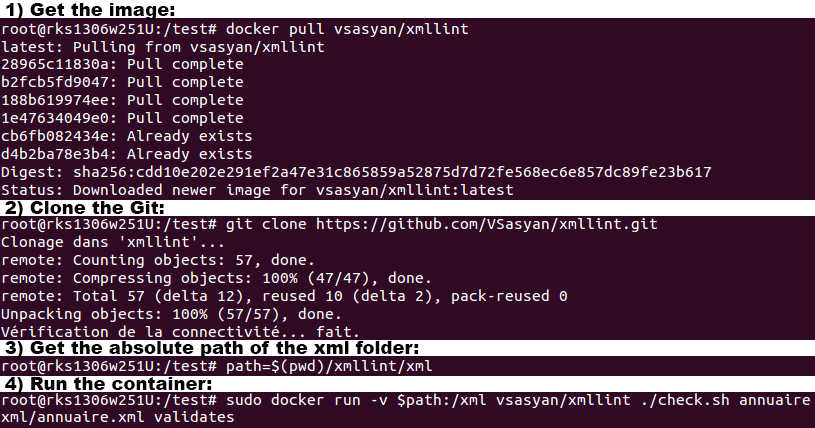

Check your XML files with docker !
==================================

This project introduces a *debian:jessie* modified image to check xml files with *xmllint*.

Objective : use the Docker Automated Builds tool in a simple utilization.

Get the image
-------------

    docker pull vsasyan/xmllint

Check your files
----------------

My file to check (with the XSD file) :

    /local/xml
        annuaire.xml
        annuaire.xsd

Command line :

    sudo docker run -v /local/xml:/xml vsasyan/xmllint ./check.sh annuaire

Expected result :

    xml/annuaire.xml validates

Try it yourself!
----------------

Try with the example files in the `xml` folder !

1. Get the image : `docker pull vsasyan/xmllint`
2. Clone the git : `git clone https://github.com/VSasyan/xmllint.git`
3. Get the absolute path of the `xml` folder: `path=$(pwd)/wmllint/xml`
4. Run the container : `sudo docker run -v $path:/xml vsasyan/xmllint ./check.sh annuaire`
 
#### Expected result

`xml/annuaire.xml validates`
